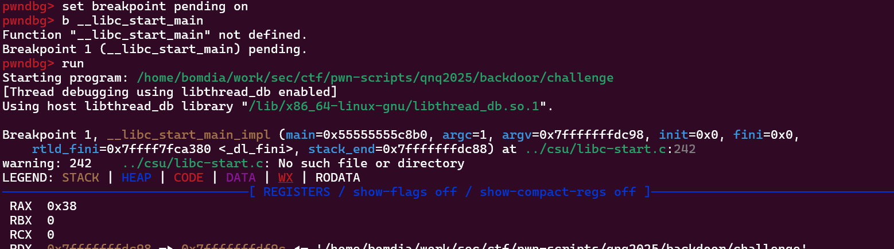

# challenge characteristics
- you get a pseudo-chell where you have access denied to most things
- looking at the binary ninja disassembly, we see that the command "/dev/shm/backdr" might be promising
- when you enter the command, you are prompted to provide a key. That key is, funnnily enough, the flag itself

So, the actual challenge is going through the code that validates your input and trying to derive the key from it

# Some annoying things
- the binary is stripped, so you get no debug symbols to work with when using gdb
- Idea: since the binary is dynamically linked, we can place a breakpoint at the main calling with
```
set breakpoint pending on
b __libc_start_main
```

from there, we can see the function arguments and find the address for main



